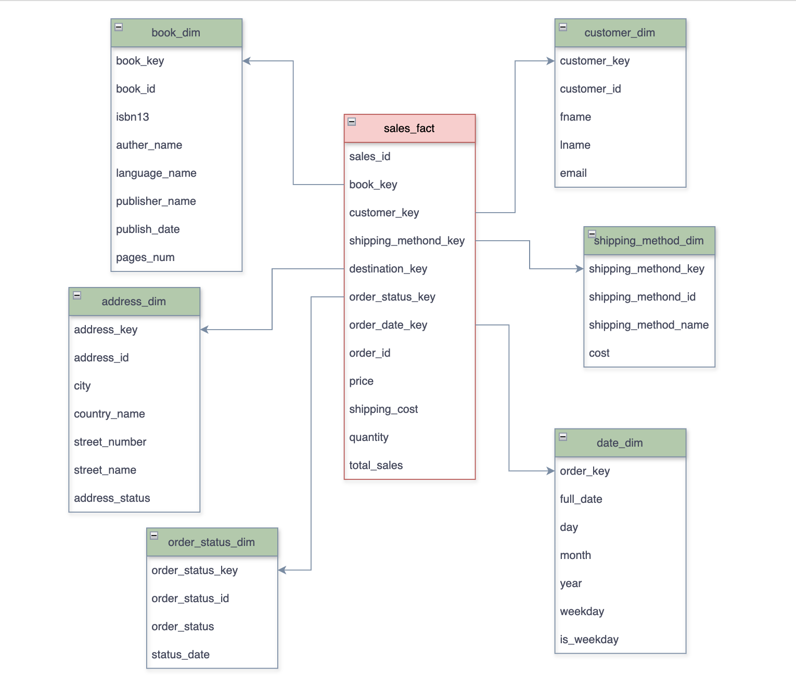
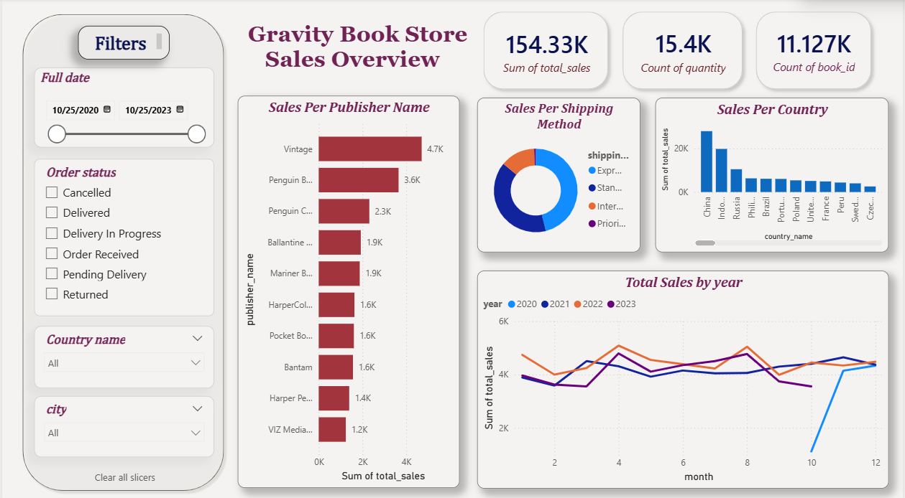
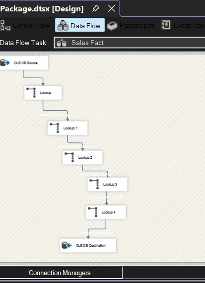

# 📚 Gravity Books - Data Warehouse

> **Transactional bookstore data → Analytics-ready star schema**, built two ways.

---

## ✦ Overview

This project transforms raw `gravity_books` transactional data into a clean, query-optimized **star schema data warehouse** (`gravity_books_dwh`), implemented via two parallel ETL approaches:

| Approach | Description |
|----------|-------------|
| 🗄️ **SQL Scripts** | Pure SQL --> schema creation, staging, dimension & fact loading |
| 📦 **SSIS Package** | Visual ETL pipeline via SQL Server Integration Services |

A **Power BI dashboard** sits on top for sales analysis and business reporting.

---

## ⭐ Star Schema - Data Model

**Fact Table**
```
Sales_fact
```

**Dimension Tables**

```
Address_dim        Book_dim           Customer_dim
Date_dim           Order_status_dim   Shipping_method_dim
```

> 📐 Model source: `Data_Model_Diagram/data_model.drawio`
> 🖼️ PNG preview: `Data_Model_Diagram/Gravity_Books_dm.png`



---

## 📊 Power BI Dashboard

Built on top of the warehouse to support sales analysis and business reporting.

> 📝 Notes: `assets/screenshots/power_bi_dashboard.png`



---

## 🗂️ Repository Structure

```
gravity-books-dwh/
│
├── Data/
│   ├── Gravity_books_DWH
│   └── gravity_books.bak          ← Source database backup
│
├── SQL/                           ← Approach 1: SQL ETL
│   ├── schema/                    ← Table definitions & relationships
│   ├── stage_layer/               ← Raw staging extraction
│   └── load_layer/                ← Dimension & fact loading
│
├── SSIS/                          ← Approach 2: SSIS ETL
│   └── GravityBooks_ETL/
│       └── Package.dtsx           ← Main SSIS package
│
├── Data_Model_Diagram/
│   ├── data_model.drawio
│   └── Gravity_Books_dm.png
│
├── Data Visualization/
│   ├── gravity_books_Dashboard.pbix
│   └── powerbi.txt
│
└── assets/screenshots/            ← ETL & dashboard screenshots
```

---

## 🔧 Approach 1 - SQL Scripts

A classic three-layer ETL sequence:

### 1. Schema Creation
- Creates all dimension and fact tables in the warehouse
- Defines primary/foreign keys and star schema relationships

### 2. Staging Layer
- Extracts source records into staging tables
- Isolates raw ingestion from warehouse loading logic

### 3. Dimension Loading
Transforms and loads descriptive entities:
- `Book_dim` — titles, authors, genres
- `Customer_dim` — customer profiles
- `Address_dim` — delivery and billing addresses
- `Date_dim` — full date hierarchy for time-based analysis
- `Shipping_method_dim` — carrier and method details
- `Order_status_dim` — order lifecycle stages

### 4. Fact Loading
- Loads transaction-level records into `Sales_fact`
- Resolves all dimension surrogate keys
- Computes `total_sales` and other core business metrics

---

## 📦 Approach 2 - SSIS

Visual ETL pipeline implemented in SQL Server Integration Services.

**Entry point:** `SSIS/GravityBooks_ETL/Package.dtsx`

### Control Flow


### Fact Load - Dimension Lookups


---

## 🚀 Quick Start

```sql
-- Step 1: Restore source database
RESTORE DATABASE gravity_books FROM DISK = 'Data/gravity_books.bak'

-- Step 2: Create warehouse database
CREATE DATABASE gravity_books_dwh
```

Then choose your ETL approach:

**Option A — SQL**
```
Run scripts in order:
  SQL/schema/ → SQL/stage_layer/ → SQL/load_layer/
```

**Option B — SSIS**
```
Open and execute:
  SSIS/GravityBooks_ETL/Package.dtsx
```

---

*Built with SQL Server · SSIS · Power BI*